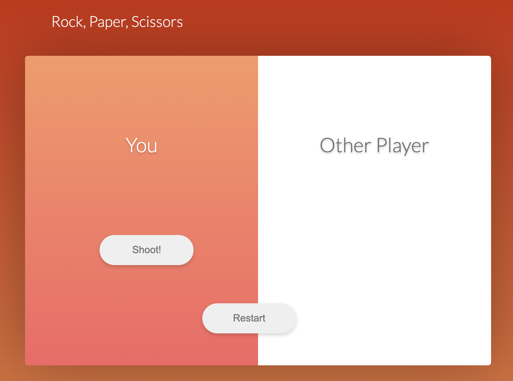

#A WebSocket is a computer communications protocol, providing full-duplex communication channels over a single TCP connection. I created a Rock, Paper, Scissors game using various languages and frameworks such as:

#Node.js
#Vue.js
#HTML
#CSS

URL: https://rockpaperscissorswebsockets.herokuapp.com/

